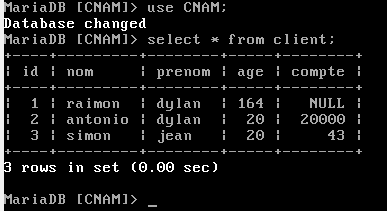

## Procédure


Les environnement système au CNAM nous permettant pas d'installer des librairies indispensables nous avons du nous débrouiller autrement

- Installation d'une machine virtuelle "Debian" sous VIRTUALBOX
  
- Installations de packages LAMP ( apache mysql php )

  
- Mise en réseau de la machine virtuelle sur le réseau avec comme addresse ip : **10.21.99.68** 

  
- Création d'une database pour les tests

  
- gestion des accès en db pour se connecter depuis l'exterieur


# Pour un fonctionnement depuis un système linux limité ( Pas de sudo ) il faut :
  - Télécharger le [MysqlConnector](https://github.com/DavidMolinari/Sysdev/blob/master/J/JDBC/mysql-connector-java-5.1.42.jar) qui permet de de faire le lien entre JDBC & MYSQL
  - Exécuter la classe Java en redéfinissant le classpath avec le jar téléchargé précédement
  ```bash 
  java -classpath :./mysql-connector-java-5.1.42.jar jdbc
  ```


